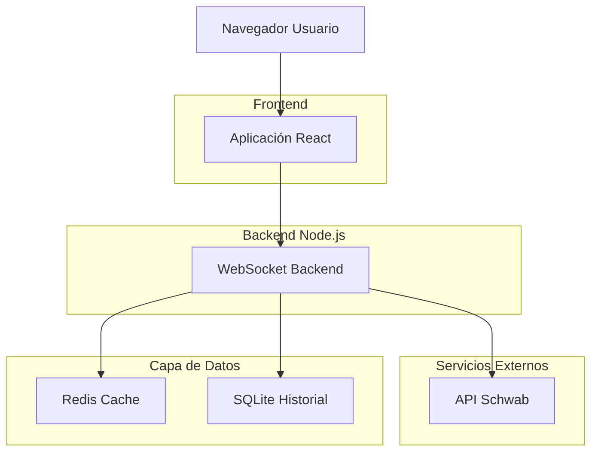
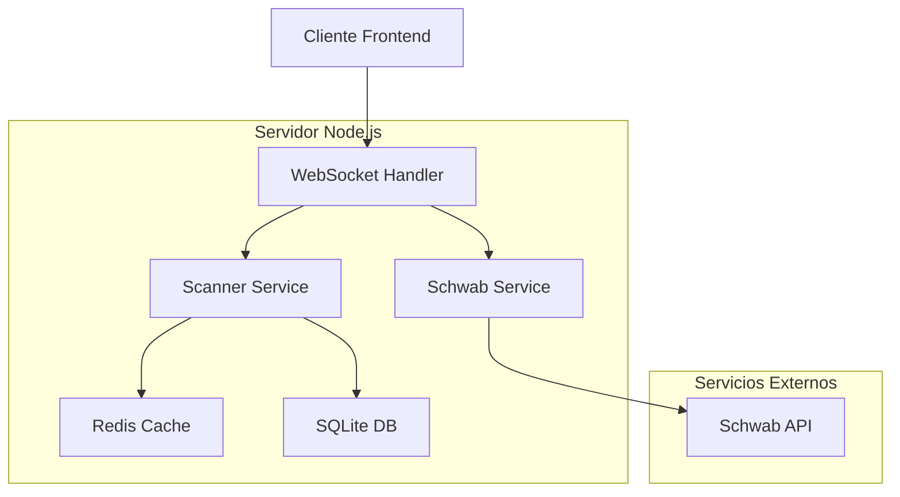
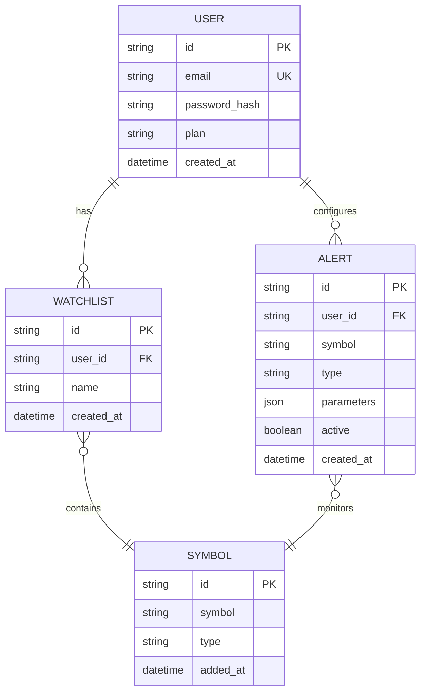

## 1. Diseño de Arquitectura



## 2. Stack Tecnológico

- **Frontend**: React@18 + TailwindCSS@3 + Vite
- **Herramienta Inicialización**: vite-init
- **Backend**: Node.js@20 + Express@4 + WebSocket(ws)
- **Base de Datos**: Redis (caché) + SQLite (historial local)
- **API Externa**: Schwab API (streaming L2)

## 3. Definición de Rutas

| Ruta | Propósito |
|-------|---------|
| / | Dashboard principal con scanners |
| /ladder/:symbol | Vista Options Ladder con time&sales |
| /scanner | Swing scanner con tabla volumen |
| /watchlist | Watchlist personal del usuario |
| /settings | Configuración API y preferencias |
| /login | Autenticación de usuario |

## 4. Definiciones API

### 4.1 APIs Backend Core

**Options Book Stream**
```
GET /api/options-book/:symbol
```

Request:
| Parámetro | Tipo | Requerido | Descripción |
|-----------|-------------|-------------|-------------|
| symbol | string | true | Símbolo OPCION (ej: SPXW251212P6895) |
| levels | number | false | Niveles de profundidad (default: 10) |

Response:
```json
{
  "symbol": "SPXW251212P6895",
  "bids": [
    {"price": 10.20, "size": 13, "exchange": "COMP"},
    {"price": 10.10, "size": 56, "exchange": "CBOE"}
  ],
  "asks": [
    {"price": 10.30, "size": 27, "exchange": "CBOE"},
    {"price": 10.30, "size": 1, "exchange": "COMP"}
  ],
  "last": {"price": 10.25, "size": 50, "time": "10:15:23"}
}
```

**Volume Scanner**
```
GET /api/scanner/volume
```

Request:
| Parámetro | Tipo | Requerido | Descripción |
|-----------|-------------|-------------|-------------|
| min_rvol | number | false | RVOL mínimo (default: 3.0) |
| min_dollar_vol | number | false | Volumen dollar mínimo (default: 50M) |
| sector | string | false | Filtrar por sector |

**WebSocket Stream**
```
WS /api/stream
```

Eventos:
- `option_trade`: Nuevo trade en opción
- `sweep_alert`: Alerta de sweep detectado
- `volume_spike**: Cambio inusual de volumen

## 5. Arquitectura del Servidor



## 6. Modelo de Datos

### 6.1 Definición Modelos



### 6.2 DDL Base de Datos

**Tabla Usuarios**
```sql
CREATE TABLE users (
    id UUID PRIMARY KEY DEFAULT gen_random_uuid(),
    email VARCHAR(255) UNIQUE NOT NULL,
    password_hash VARCHAR(255) NOT NULL,
    plan VARCHAR(20) DEFAULT 'free' CHECK (plan IN ('free', 'pro')),
    created_at TIMESTAMP WITH TIME ZONE DEFAULT NOW()
);
```

**Tabla Alertas**
```sql
CREATE TABLE alerts (
    id UUID PRIMARY KEY DEFAULT gen_random_uuid(),
    user_id UUID REFERENCES users(id),
    symbol VARCHAR(50) NOT NULL,
    type VARCHAR(50) NOT NULL,
    parameters JSONB,
    active BOOLEAN DEFAULT true,
    created_at TIMESTAMP WITH TIME ZONE DEFAULT NOW()
);
```

**Tabla Histórico Trades**
```sql
CREATE TABLE trade_history (
    id UUID PRIMARY KEY DEFAULT gen_random_uuid(),
    symbol VARCHAR(50) NOT NULL,
    price DECIMAL(10,2) NOT NULL,
    size INTEGER NOT NULL,
    side VARCHAR(10) NOT NULL,
    exchange VARCHAR(10),
    timestamp TIMESTAMP WITH TIME ZONE DEFAULT NOW()
);

CREATE INDEX idx_trade_history_symbol_time ON trade_history(symbol, timestamp DESC);
```

## 7. Variables de Entorno

```bash
# Schwab API
SCHWAB_APP_KEY=your_app_key_here
SCHWAB_SECRET=your_secret_here
SCHWAB_REDIRECT_URI=http://localhost:3000/callback

# Base de Datos
REDIS_URL=redis://localhost:6379
DATABASE_URL=sqlite://./tape_reading.db

# Servidor
PORT=3001
NODE_ENV=development

# Frontend
VITE_API_URL=http://localhost:3001
VITE_WS_URL=ws://localhost:3001
```

## 8. Consideraciones de Performance

- **WebSocket**: Implementar throttling de mensajes (máx 100/segundo)
- **Redis**: TTL de 5 minutos para datos de mercado en caché
- **SQLite**: Índices en symbol y timestamp para queries rápidas
- **Frontend**: Virtualización de listas largas con react-window