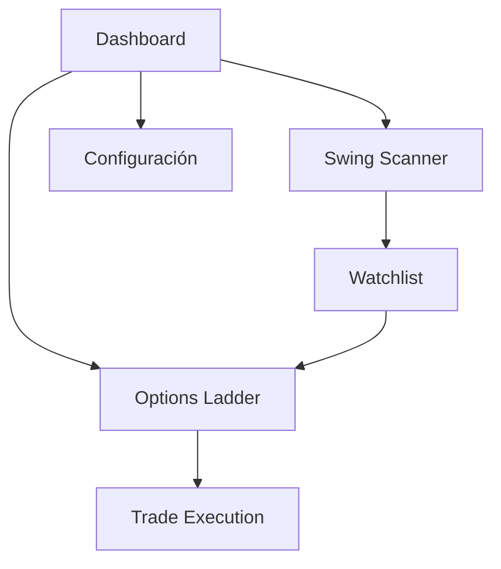

## 1. Visión del Producto

Plataforma de análisis de flujo de mercado en tiempo real para traders de 0DTE SPX/SPXW y swing trading en acciones. Detecta y anticipa movimientos institucionales combinando tape reading (microestructura) + contexto derivativos/volumen (macro).

**Usuarios objetivo:** Traders intradía 0DTE SPX/SPXW (scalps 30s-5min) y swing traders acciones (2-10 días, volumen institucional)

## 2. Características Principales

### 2.1 Tipos de Usuario

| Rol         | Método de Registro  | Permisos Principales                                         |
| ----------- | ------------------- | ------------------------------------------------------------ |
| Trader Free | Registro email      | Acceso a ladder básico, scanner limitado                     |
| Trader Pro  | Suscripción mensual | Acceso completo a todas las herramientas, alertas ilimitadas |

### 2.2 Módulos de Funcionalidad

Nuestra plataforma de tape reading consiste en las siguientes páginas principales:

1. **Dashboard**: Vista general con scanner 0DTE, scanner swing y watchlist
2. **Options Ladder**: Libro de opciones L2, time & sales, alertas sweep
3. **Swing Scanner**: Tabla de volumen inusual, filtros, mini charts
4. **Watchlist**: Símbolos guardados, alertas pendientes
5. **Configuración**: API keys, alertas, sonidos, replay

### 2.3 Detalles de Páginas

| Nombre de Página | Módulo         | Descripción de Funcionalidades                                       |
| ---------------- | -------------- | -------------------------------------------------------------------- |
| Dashboard        | Scanner 0DTE   | Muestra opciones SPXW con mayor actividad, filtros por expiry/strike |
| Dashboard        | Scanner Swing  | Tabla RVOL>3x, $Vol>50M, cambio porcentual y acción sugerida         |
| Dashboard        | Watchlist      | Acceso rápido a símbolos favoritos con estado de alertas             |
| Options Ladder   | Book L2        | Visualización en tiempo real de bid/ask por exchange con colores     |
| Options Ladder   | Time & Sales   | Stream de trades con timestamp, precio, tamaño y agresor             |
| Options Ladder   | Sweep Detector | Alertas automáticas para trades >50 contratos en múltiples exchanges |
| Options Ladder   | GEX Overlay    | Líneas horizontales call/put wall si datos disponibles               |
| Swing Scanner    | Tabla Volumen  | Ranking acciones por RVOL, volumen dollar, cambio y señales técnicas |
| Swing Scanner    | CVD Indicator  | Presión compra/venta aproximada porcentual                           |
| Swing Scanner    | Filtros        | RVOL mínimo, volumen dollar, cambio porcentual, sector               |
| Watchlist        | Gestión        | Agregar/eliminar símbolos, ver estado alertas activas                |
| Configuración    | API Keys       | Gestión credenciales Schwab, configuración conexión                  |
| Configuración    | Alertas        | Umbrales sweep, cambios de volumen, sonidos personalizados           |

## 3. Flujos Principales

### Flujo 0DTE SPXW

El trader accede al dashboard, selecciona "SPXW Today", elige expiry y strike específico. Abre el ladder con time\&sales, configura alertas de sweep >50 contratos. Identifica lifting de offers cerca de call wall para entry.

### Flujo Swing Scanner

El trader accede al scanner, filtra por RVOL>3 + $Vol>50M. Revisa NVDA con mini ladder, CVD y news. Detecta break VWAP + 65% bid hits para agregar a watchlist.

## 4. Diseño de Interfaz

### 4.1 Estilo Visual

* **Colores primarios**: Verde (#00FF00) para asks/alcista, Rojo (#FF0000) para bids/bajista, Negro (#000000) fondo

* **Estilo botones**: Bordes redondeados, hover effects, colores de contraste alto

* **Tipografía**: Monoespaciada para datos (Consolas), sans-serif para UI (Inter)

* **Layout**: Basado en cards, grid responsivo, paneles arrastrables

* **Iconos**: Estilo outline minimalista, animaciones sutiles en alertas

### 4.2 Elementos por Página

| Página         | Módulo        | Elementos UI                                                                      |
| -------------- | ------------- | --------------------------------------------------------------------------------- |
| Dashboard      | Scanner 0DTE  | Tabla scrollable con highlights verde/rojo, filtros dropdown, badges de actividad |
| Options Ladder | Book L2       | Ladder vertical con 10 niveles, colores intensos, animación slide para updates    |
| Time & Sales   | Stream        | Lista auto-scroll con fade-in, timestamp, tamaño en negrita, agresor destacado    |
| Swing Scanner  | Tabla Volumen | Filas alternadas gris oscuro, iconos de tendencia, botones de acción compactos    |

### 4.3 Responsividad

Diseño desktop-first optimizado para monitores 1920x1080+, adaptable a 1366x768. Panel lateral colapsable para tablets. Versión móvil simplificada en roadmap Fase 3.

## 5. Métricas de Éxito

* Latencia primer señal: <3 segundos desde stream

* Actualización ladder: máximo 100ms

* Uptime streaming: 99.9% (dependiente Schwab)

* Usuarios beta: 100 traders en mes 3

* Retención semanal: 70% objetivo

